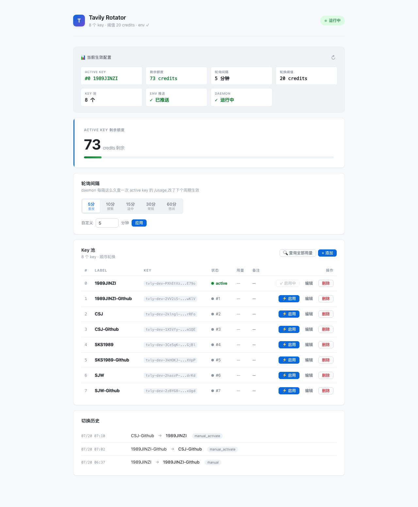
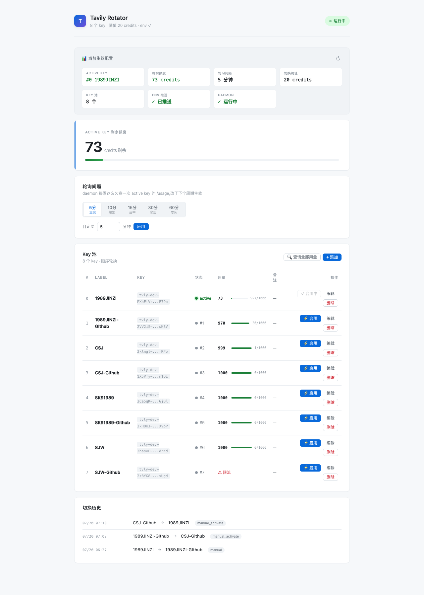

# Tavily Key Rotator

**A macOS daemon that rotates Tavily API keys automatically. Never hit a 429 again.**

Tavily's free tier gives you 1,000 credits per key per month. If you have multiple keys (or multiple accounts), `tavily-rotator` rotates between them automatically — when the active key drops below a threshold, it switches to the next one and pushes the new key to your environment via `launchctl setenv`. You get a local web dashboard to manage keys, check usage, and configure rotation.

[中文说明见下方](#中文说明)

---

## ✨ Features

- **Automatic rotation** — When the active key drops below the threshold (default 20 credits), switches to the next key in your pool
- **Web dashboard** — `http://127.0.0.1:8731/` to add/remove keys, check usage, set poll interval, view rotation history
- **Zero tvly changes** — Your `tvly` CLI works as-is; the daemon pushes the active key to the environment
- **launchd integration** — Auto-starts on login, restarts on crash (KeepAlive), survives reboots
- **Rate-limit aware** — Throttles `/usage` queries to avoid Tavily's 429
- **Atomic config writes** — `keys.toml` is rewritten atomically (temp file + fsync + rename), so a crash never corrupts your key pool
- **Self-contained** — Single 2.9MB Rust binary, no runtime dependencies

## 📸 Screenshots



*Dashboard showing active key remaining credits, current config snapshot, rotation settings, and key pool.*



*After clicking "查询全部用量", each key's real-time usage fills into the table with mini progress bars.*

## 🚀 Install

### Prerequisites

- **macOS, Linux, or Windows**
  - macOS: Apple Silicon or Intel
  - Linux: any distro with systemd (Ubuntu, Fedora, Arch, etc.)
  - Windows: 10/11 (Task Scheduler)
- **Rust toolchain** — Install with:
  ```bash
  curl --proto '=https' --tlsv1.2 -sSf https://sh.rustup.rs | sh
  ```
  Windows: download from [rustup.rs](https://rustup.rs)
- **Tavily API key(s)** — Sign up at [tavily.com](https://tavily.com) (free, 1,000 credits/month per key)

### Steps (macOS / Linux)

```bash
git clone https://github.com/ShengjiaCui/tavily-rotator.git
cd tavily-rotator
./scripts/install.sh
```

The installer auto-detects your platform and uses the native service manager:
- **macOS** → launchd plist (`com.tavily-rotator`)
- **Linux** → systemd user service (`tavily-rotator.service`)

### Steps (Windows)

```powershell
git clone https://github.com/ShengjiaCui/tavily-rotator.git
cd tavily-rotator
powershell -ExecutionPolicy Bypass -File scripts/install-windows.ps1
```

Uses Task Scheduler (`TavilyRotator` task) for auto-start on login + crash restart.

### After install (all platforms)

1. Open **http://127.0.0.1:8731/** in your browser
2. Click **"+ 添加"** to add your Tavily key(s)
3. Done — the daemon rotates automatically

### Verify

```bash
./scripts/selftest.sh   # 14 checks, should all PASS
```

## 🔧 How it works

```
You open a new terminal
  → shell reads the active key from the environment
  → tvly CLI uses it, calls Tavily API, works

Every N minutes (default 30, configurable):
  daemon queries active key's /usage
  → if remaining < threshold, rotate to next key
  → push new key to system environment (platform-specific)
  → new terminals get the new key
```

**Platform-specific key pushing:**
- **macOS**: `launchctl setenv` (persistent, survives daemon crash)
- **Linux**: writes `~/.config/tavily-rotator/active-env.sh`, sourced from `.bashrc`/`.zshrc`
- **Windows**: writes registry `HKCU\Environment\TAVILY_API_KEY` + broadcasts `WM_SETTINGCHANGE`

## ⚙️ Configuration

Config lives in `~/.config/tavily-rotator/keys.toml` (mode `0600`):

```toml
rotate_threshold = 20         # rotate when remaining < this
poll_interval_minutes = 30    # how often to check /usage

[[keys]]
label = "work-main"
secret = "tvly-dev-xxxxxxxxxxxxxxxxx"
note = "my main key"          # optional, ≤100 chars

[[keys]]
label = "backup-1"
secret = "tvly-dev-yyyyyyyyyyyyyyyyy"
note = ""
```

You can edit this file directly, or use the web dashboard (recommended — it validates keys via `/usage` before saving).

## 📋 Commands

```bash
# Web dashboard
open http://127.0.0.1:8731/

# Check status
curl -s http://127.0.0.1:8731/api/active | python3 -m json.tool

# Restart daemon
launchctl kickstart -k gui/$(id -u)/com.tavily-rotator

# Stop
launchctl bootout gui/$(id -u)/com.tavily-rotator

# Logs
tail -f ~/.local/share/tavily-rotator/daemon.log

# Upgrade (after git pull)
./scripts/install.sh --rebuild

# Self-test
./scripts/selftest.sh
```

## ⚠️ Known limitations

- **Long-lived processes** — A terminal/Claude session/cron job started *before* a rotation keeps using the old key until restarted. The daemon rotates early (at 50 credits remaining) and warns in the UI. This is a deliberate tradeoff for simplicity — no wrapper script, `tvly` stays untouched.
- **Linux shells** — The active key is pushed via a file sourced from `.bashrc`/`.zshrc`. If you use fish/nush/elvish, you need to add the `source` line manually to your shell's config. Already-open shells don't get the update until reopened.
- **Don't run `tvly login`** — It stores credentials locally and overrides the environment variable injection, breaking rotation. The dashboard warns you if it detects this.

## 🏗️ Development

```bash
git clone https://github.com/ShengjiaCui/tavily-rotator.git
cd tavily-rotator
cargo build                    # debug build
cargo build --release          # optimized (2.9MB)
./scripts/install.sh --rebuild # rebuild + restart daemon
./scripts/selftest.sh          # 14-point health check
```

**Architecture** — Single Rust binary, 7 modules:
- `config.rs` — keys.toml load/validate/atomic-write
- `env_push.rs` — launchctl setenv push (GUI domain + user session)
- `db.rs` — SQLite state (usage snapshots, rotations, active pointer)
- `tavily.rs` — /usage endpoint query
- `rotator.rs` — rotation state machine (tokio timer, threshold check)
- `api.rs` — axum HTTP server + all routes
- `install.rs` — environment detection + one-click install

## 📄 License

MIT — see [LICENSE](LICENSE).

---

## 中文说明

**Tavily Key Rotator** 是一个 macOS 常驻 daemon,在多个 Tavily 免费 API key 之间自动轮换。

### 为什么需要

Tavily 免费层每个 key 每月 1,000 credits,月初重置。如果你有多个 key(多个账号),手动切换很烦——忘了改环境变量就撞 429。这个 daemon 自动帮你切换:当前 key 额度不足时,自动换下一个,推到系统环境变量,新开的终端立即用新 key。

### 安装

```bash
# 前置:macOS + Rust(tavily.com 注册免费 key)
git clone https://github.com/ShengjiaCui/tavily-rotator.git
cd tavily-rotator
./scripts/install.sh
# 浏览器打开 http://127.0.0.1:8731/ 添加你的 key
```

### 已知限制

- **仅支持 macOS**(依赖 launchd)
- **长寿进程**:已经在跑的终端/Claude 会话/cron 在轮换后继续用老 key,撞 429 需手动重启。daemon 会提前轮换(剩余 50 时)并在界面提示
- **不要运行 `tvly login`**:会把凭据存本地,覆盖环境变量注入,轮换失效。界面会检测并警告

### 使用问题

- **tvly 报 429?** → 重开终端(拿新 key),或 `curl -X POST http://127.0.0.1:8731/api/rotate` 手动轮换
- **daemon 没跑?** → `launchctl kickstart -k gui/$(id -u)/com.tavily-rotator` 重启
- **看日志** → `tail -f ~/.local/share/tavily-rotator/daemon.log`

详细文档见 [runbook](runbooks/llmops/tavily-key-rotator.md)(opdev 内部)或源码注释。
